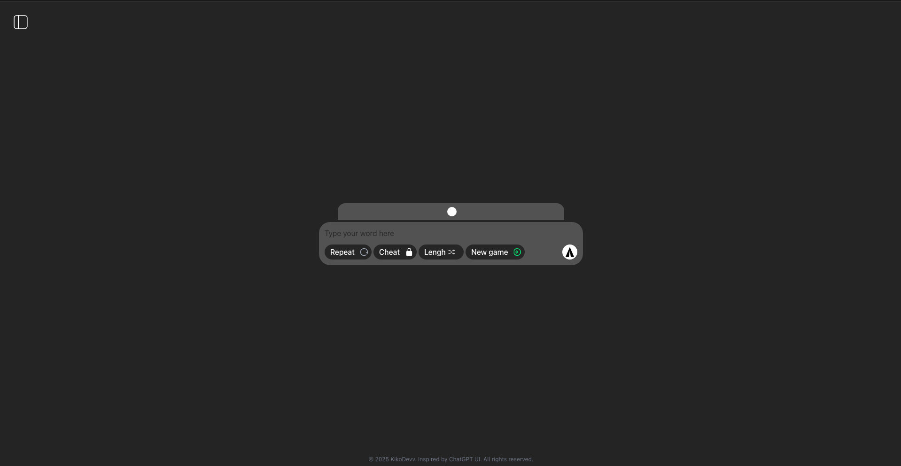
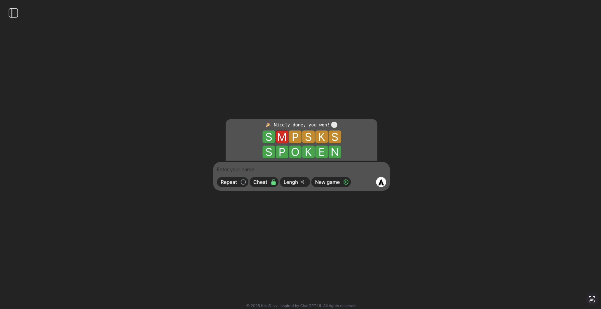

  
  <h2>Wordle-GPT Fullstack</h2>
  
A full-stack word puzzle game with MongoDB data persistence, server-side word validation, customizable gameplay options, and competitive leaderboard with timing features.

  <h2>Screenshots</h2>

  
  

## Features

- 🎮 **Customizable Gameplay**: Choose word length (2-6 letters), allow repeated letters, and toggle cheat mode
- ⏱️ **Precise Timing**: Game duration tracking from first guess to correct answer
- 🏆 **Competitive Leaderboard**: Compare scores, attempts, and completion times with other players
- 💾 **Data Persistence**: Player stats and game sessions stored in MongoDB
- 🔒 **Secure Validation**: Word comparison logic runs server-side to prevent cheating
- 🎨 **Modern UI**: Clean, responsive design with smooth animations

  <h2>🚀 Visit the deployed version: <a href="https://wordle-gpt.vercel.app/">Wordle-GPT</a></h2>

  Made with ❤️ by <a href="https://github.com/kikoDevv">KikoDevv</a>

  📧 Contact: <a href="mailto:Kiko.devv@gmail.com">Kiko.devv@gmail.com</a>

